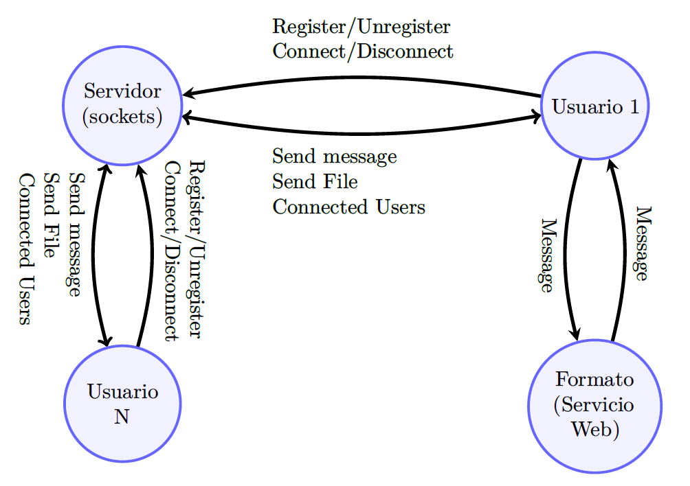
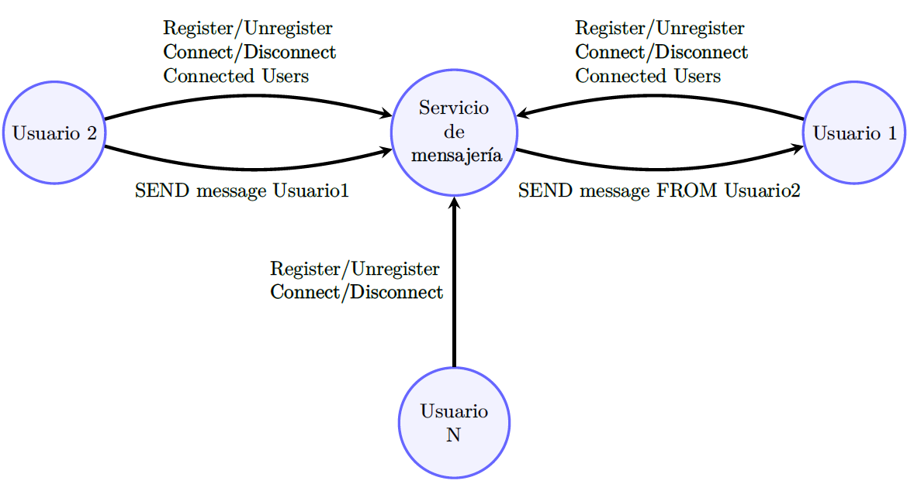
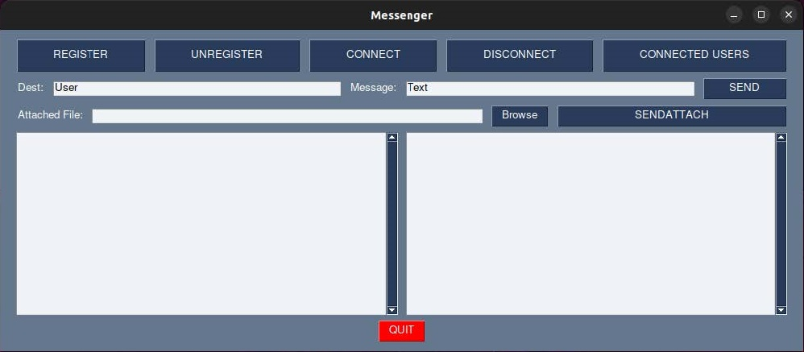
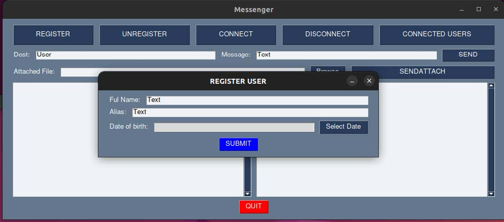
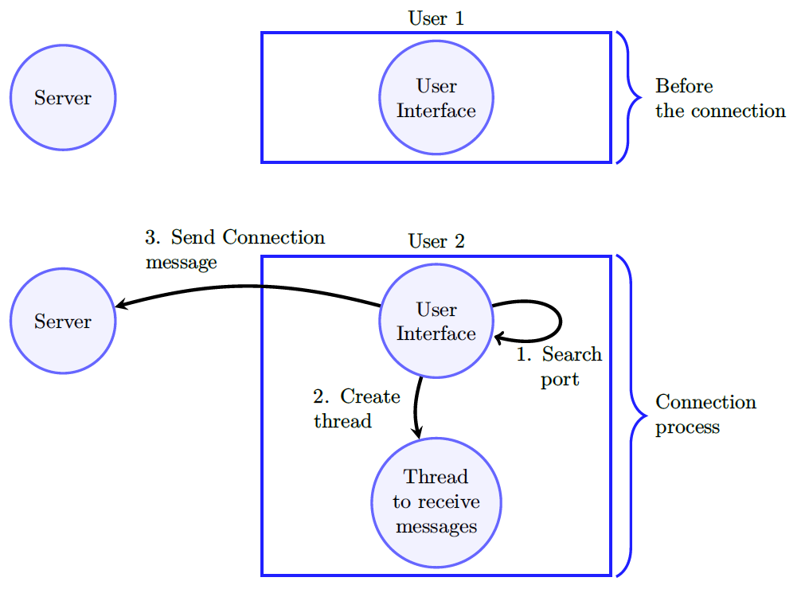
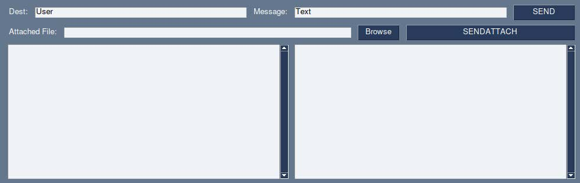
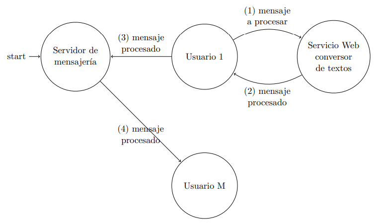

# Práctica Final: Servicio de envío de mensajes
By Luis Daniel Casais Mezquida & Lucía María Moya Sans  
Sistemas Distribuídos 22/23  
Bachelor's Degree in Computer Science and Engineering  
Universidad Carlos III de Madrid


# Descripción del ejercicio

1. [Objetivo](#1-objetivo)
2. [Descripción de la funcionalidad](#2-descripción-de-la-funcionalidad)
3. [Primera parte](#3-primera-parte)
4. [Prerrequisitos](#4-prerrequisitos)
5. [Ejecución y uso de la Interfaz](#5-ejecución-y-uso-de-la-interfaz)
    1. [Cuadros de texto de la interfaz de usuario](#51-cuadros-de-texto-de-la-interfaz-de-usuario)
6. [Desarrollo del cliente](#6-desarrollo-del-cliente)
    1. [Registro en el sistema](#61-registro-en-el-sistema)
    2. [Darse de baja en el sistema](#62-darse-de-baja-en-el-sistema)
    3. [Conectarse al sistema](#63-conectarse-al-sistema)
    4. [Desconectarse del sistema](#64-desconectarse-del-sistema)
    5. [Envío de un mensaje](#65-envío-de-un-mensaje)
    6. [Recepción de mensajes](#66-recepción-de-mensajes)
    7. [Petición de usuarios conectados](#67-petición-de-usuarios-conectados)
7. [Desarrolo del servidor](#7-desarrollo-del-servidor)
    1. [Uso del servidor](#71-uso-del-servidor)
    2. [Registro de un cliente](#72-registro-de-un-cliente)
    3. [Baja de un cliente](#73-baja-de-un-cliente)
    4. [Conexión de un cliente](#74-conexión-de-un-cliente)
    5. [Desconexión de un cliente](#75-desconexión-de-un-cliente)
    6. [Envío de un mensaje](#76-envío-de-un-mensaje)
    7. [Solicitud de usuarios conectados](#77-solicitud-de-usuarios-conectados)
8. [Protocolo de comunicación](#8-protocolo-de-comunicación)
    1. [Registro](#81-registro)
    2. [Baja](#82-baja)
    3. [Conexión](#83-conexión)
    4. [Desconexión](#84-desconexión)
    5. [Envío de un mensaje cliente-servidor](#85-envío-de-un-mensaje-cliente-servidor)
    6. [Envío de un mensaje servidor-cliente](#86-envío-de-un-mensaje-servidor-cliente)
    7. [Solicitud de usuarios conectados](#87-solicitud-de-usuarios-conectados)
8. [Segunda parte](#9-segunda-parte)
    1. [Desarrollo del servicio web](#91-desarrollo-del-servicio-web)


## 1. Objetivo
El objetivo de esta práctica es que el alumno conozca y practique los principales conceptos relacionados con el diseño e implementación de una aplicación distribuida que utiliza distintas tecnologías y lenguajes de programación (Sockets y Servicios Web).

## 2. Descripción de la funcionalidad
El objetivo de la práctica es desarrollar un servicio de notificación de mensajes entre
usuarios conectados a Internet, de forma parecida, aunque con una funcionalidad mucho más
simplificada, a lo que ocurre con la aplicación WhatsApp. Se podrán enviar mensajes de texto
de un tamaño máximo de 256 bytes (incluyendo el código 0 que indica fin de cadena, es decir,
como mucho la cadena almacenada en el mensaje tendrá una longitud máxima de 255 caracteres)
y de forma opcional se podrá también enviar archivos adjuntos de cualquier tamaño. El esquema
final de la aplicación es el que se muestra en la **Figura 1**.



El desarrollo de esta práctica se hará de forma incremental. En una primera parte, se deberá desarrollar la funcionalidad que se muestra en la **Figura 2**. En esta primera parte no será necesario enviar ficheros adjuntos. Esta funcionalidad se incluirá más adelante.

## 3. Primera parte
El estudiante deberá diseñar, codificar y probar, utilizando el lenguaje C y sobre un sistema operativo Linux, un servidor que gestione la funcionalidad del sistema y, por otro lado, deberá diseñar, codificar y probar, utilizando el lenguaje Python, el código de los clientes. Toda la práctica tendrá que desarrollarse y funcionar correctamente en las aulas de laboratorio utilizadas por la asignatura.  

A continuación se detallan las características del sistema. En esta parte de la memoria
se va a describir el protocolo a seguir entre el servidor y el cliente. Este protocolo permitirá a
cualquier cliente que lo siga comunicarse con el servidor implementado. Esto hace que, diferentes
alumnos puedan probar sus clientes con los servidores desarrollados por otros.



Para el almacenamiento de los usuarios y de los mensajes se podrá utilizar la implementación que se desee: listas en memoria o ficheros.  

### 3.1 Desarrollo del servicio

El objetivo es diseñar y desarrollar los dos siguientes programas:
- Un servidor concurrente multihilo que proporciona el servicio de comunicación entre los distintos clientes registrados en el sistema, gestiona las conexiones de los mismos y el almacenamiento de los mensajes enviados a un cliente no conectado en el sistema.
- Un cliente multihilo que se comunica con el servidor y es capaz de enviar y recibir mensajes. Uno de los hilos se utilizará para enviar mensajes al servidor y el otro para recibirlos.

## 4. Prerrequisitos
Para poder utilizar la interfaz de usuario proporcionada, el primer paso consiste en tener todas las dependencias instaladas. En primer lugar, el usuario debe asegurarse de tener instalada una versión de Python igual o superior a la versión 3.10.
```bash
python3 --version
```
Si el usuario no posee esta versión de Python se puede instalar de la siguiente forma:
```bash
sudo apt-get install python3.10 python3-pip
```

Una vez instalada la versión de Python, se deberá instalar el resto de paquetes necesarios
para poder usar la interfaz con los comandos que se muestran a continuación:
```bash
sudo apt-get install python3-tk
pip3 install pysimplegui
```

## 5. Ejecución y uso de la Interfaz
Una vez se han instalado todos los paquetes previos, se podrá ejecutar el programa cliente de la siguiente forma:
```bash
python3 ./client.py -s <IP> -p <PUERTO>
```

Al comienzo de la práctica, como no se tendrá ningún servidor preparado, se puede utilizar la interfaz indicando que la IP sea `localhost` y el puerto sea el que el usuario desee (e.g. `8888`): 
```bash
$ python3 ./client.py -s localhost -p 8888
```

Tras ejecutar el comando se mostrará una interfaz como la que se muestra en la **Figura 3**.  
Como se puede comprobar, en esta interfaz se tienen varios botones que el usuario tendrá que usar e implementar en el fichero [`src/client.py`](src/client.py) proporcionado. Los botones que se encuentran en la interfaz son los siguientes:
- `REGISTER`
- `UNREGISTER`
- `CONNECT`
- `DISCONNECT`
- `CONNECTED USERS`
- `SEND`
- `SENDATTACH`



Cada uno de estos botones tiene una funcionalidad especificada. Sin embargo, en las siguientes líneas se explicará el código proporcionado para que el estudiante se haga una idea de cómo debe proceder para añadir las funcionalidades solicitadas.  
A lo largo de la ejecución del cliente pueden obtenerse errores debidos a la red (servidor caído, fallo en la red, etc), todos estos errores hay que tenerlos en cuenta (véase [Sección 8](#8-protocolo-de-comunicación)), por tanto, se recomienda hacer un correcto tratamiento de los errores devueltos por las llamadas al sistema y de la biblioteca de sockets utilizada.


### 5.1 Cuadros de texto de la interfaz de usuario
La interfaz cuenta con dos cuadros de texto situados en la parte inferior destinados a mostrar los mensajes de interacción del usuario con la interfaz y de la parte cliente con el servidor. El cuadro de texto de la izquierda se utilizará para ir mostrando los mensajes de interacción del usuario (cliente) con el servidor. Cada vez que se desee mostrar un mensaje de texto en este cuadro se utilizará el siguiente fragmento de código:
```python
window["_CLIENT_"].print("TEXTO A MOSTRAR EN LA INTERFAZ")
```

Donde `window["_CLIENT_"]` es la variable de la interfaz en la que se se escriben los mensajes de texto a mostrar en el cuadro de texto de la izquierda de la interfaz. En esta parte se irán mostrando los mensajes de interacción entre el cliente (usuario) y el servidor.  
Cada vez que se desee mostrar un mensaje de texto en la parte derecha de la interfaz, asociada a los mensajes recibidos del servidor, se utilizará el siguiente fragmento de código:
```python
window["_SERVER_"].print("TEXTO A MOSTRAR EN LA INTERFAZ")
```

Donde `window["_SERVER_"]` es la variable de la interfaz en la que se se escriben los mensajes de texto a mostrar en el cuadro de texto de la derecha de la interfaz. En esta parte se irán mostrando los mensajes recibidos del servidor como respuesta a las peticiones realizadas por el cliente.  
En lo que resta de memoria se utilizará el siguiente convenio para imprimir mensajes en los cuadros de texto de la intertaz. Los mensajes que se muestren en la parte derecha tendrán el siguiente formato:
```
c> TEXTO A MOSTRAR
```

Los mensajes que se muestren en la parte izquierda tendrán el siguiente formato:
```
s> TEXTO A MOSTRAR
```

## 6. Desarrollo del cliente

### 6.1 Registro en el sistema
El botón `REGISTER` permitirá el registro del usuario en el servidor cuya dirección y puerto se ha pasado por parámetros en la terminal de Linux y se habrán almacenado en las variables `client._server` y `client._port`.  
Tras esto, el primer paso del usuario será registrarse en el sistema, puesto que el resto de botones no se podrán utilizar hasta que no haya un registro válido en el servidor. Para ello, el usuario tendrá que utilizar el botón `REGISTER` que abrirá una ventana nueva como la que se ve a continuación:



En la ventana que se muestra aparecen 3 campos a rellenar por los usuarios, el nombre completo, el alias y la fecha de nacimiento. Los tres campos deben ser rellenados por los usuarios y con un nombre diferente a `Text`. Si la interfaz detecta que se ha dejado por defecto estos valores lo interpretará como erróneo y no se almacernán estas entradas para su envío al servidor.  
El tercer campo mostrado es la fecha de nacimiento, campo donde el usuario tendrá que utilizar al botón `Select Date` y seleccionar la fecha. Esta fecha se mostrará en el formato `DD/MM/AAAA`.  
Una vez se han rellenado los 3 campos correctamente, el usuario tendrá que utilizar el botón `SUBMIT` para que el programa haga las comprobaciones necesarias y almacene estos valores para su envío al servidor.  
Estas entradas se almacenarán en las variables `client._username`, `client._alias` y `client._date`, variables que se tendrán que enviar al servidor para registrarlo y que de el visto bueno. En caso contrario, el usuario deberá hacer de nuevo el registro.

#### Mensajes de salida
Cada vez que se realiza una operación, su resultado se mostrará en los cuadros de texto asociados a la interfaz (recuerde que los mensajes con `c>` se muestran en el cuadro de texto izquierdo y los mensajes con `s>` en el cuadro de texto derecho).  
Cuando un cliente quiera registrarse como usuario del servicio deberá mostrar en la zona de texto del cliente el siguiente mensaje:
```
c> REGISTER <userName>
```

Este servicio, una vez ejecutado en el servidor, puede devolver tres resultados (cuyos valores se describen detalladamente en la sección destinada a describir el protocolo de comunicación): `0` si la operación se ejecutó con éxito, `1` si ya existe un usuario registrado con el mismo nombre y `2` en cualquier otro caso. Si la operación se realiza correctamente, el cliente recibirá por parte del servidor un mensaje con código `0` y mostrará en la zona de texto designada para el servidor (parte derecha) el siguiente mensaje: 
```
s> REGISTER OK
```

Si el usuario ya está registrado se mostrará:
```
s> USERNAME IN USE
```
En este caso el servidor no realizará ningún registro.  

En caso de que no se pueda realizar la operación de registro, bien porque el servidor este caído o bien porque se devuelva el código `2`, se mostrará el siguiente mensaje:
```
s> REGISTER FAIL
```

### 6.2 Darse de baja en el sistema
El botón `UNREGISTER` permitirá dar de baja y borrar al usuario del servidor. Por lo tanto, si el usuario existiese, se eliminaría tanto del cliente como del servidor, limpiando o vaciando las variables mencionadas anteriormente en el registro.

#### Mensajes de salida
Cuando un cliente quiere darse de baja del servicio de mensajería deberá mostrar en la interfaz:
```
c> UNREGISTER <userName>
```

Este servicio una vez ejecutado en el servidor, puede devolver tres resultados: `0` si la operación se realiza con éxito, `1` si el usuario no existe y `2` en cualquier otro caso. Si el usuario que se quiere dar de baja del servicio no existe, el servidor retornará un `1` (descrito en la sección destinada a describir el protocolo de comunicación). En este caso se mostrará el siguiente mensaje en la zona designada del servidor:
```
s> USER DOES NOT EXIST
```

Si la operación de baja se realiza correctamente y el usuario es borrado en el servidor, el servidor devolverá un `0` y el cliente mostrará:
```
s> UNREGISTER OK
```

En caso de que no se pueda realizar esta operación, bien porque el servidor este caído y no se pueda establecer la conexión con él o bien porque devuelva el código `2`, se mostrará el siguiente mensaje:
```
s> UNREGISTER FAIL
```

### 6.3 Conectarse al sistema
El botón `CONNECT` permitirá al usuario conectarse al servidor para poder establecer conversaciones con otros usuarios registrados en el sistema y recibir los mensajes que estuviesen esperando a ser enviados al usuario recién conectado.  
Se va a considerar que desde una interfaz de usuario **solo puede haber un único usuario conectado a la vez**.

#### Mensajes de salida
Una vez que un cliente está registrado en el sistema de mensajería, este puede conectarse y desconectarse del servicio tantas veces como desea. Para conectarse debe enviar (utilizando el protocolo descrito en la [Sección 7](#7-desarrollo-del-servidor)) al servidor su dirección IP y puerto para que éste pueda enviarle los mensajes de otros usuarios. La estructura de un proceso cliente conectado al servicio se muestra en la **Figura 5**.  

Para ello el cliente introducirá en la interfaz:
```
c> CONNECT <userName>
```

Internamente el cliente buscará un puerto válido libre (1).  
Una vez obtenido el puerto, y antes de enviar el mensaje al servidor, el cliente debe crear un hilo (2) que será el encargado de escuchar (en la IP y puerto seleccionado) y atender los envíos de mensajes de otros usuarios procedentes del servidor.



A continuación, el cliente enviará (3) la solicitud de conexión al servidor. Una vez establecida la conexión en el sistema, el servidor devolverá un byte que codificará el resultado de la operación: `0` en caso de éxito, `1` si el usuario no existe, `2` si el usuario ya está conectado y `3` en cualquier otro caso.  

Si todo ha ido bien, se mostrará:
```
s> CONNECT OK
```

En caso de código `1` (usuario no está registrado en el sistema), el cliente mostrará el siguiente error:
```
s> CONNECT FAIL, USER DOES NOT EXIST
```

En caso de que el cliente ya estuviera conectado en el sistema (código `2`), el cliente mostrará:
```
s> USER ALREADY CONNECTED
```

En caso de que no se pueda realizar la operación de conexión, bien porque el servidor este caído, se produzca un error en las comunicaciones o se devuelva el código `3`, se mostrará el siguiente mensaje:
```
s> CONNECT FAIL
```

### 6.4 Desconectarse del sistema
El botón `DISCONNECT` permitirá al usuario desconectarse al servidor. 

### Mensajes de salida
Cuando un usuario se desconecta del servicio se mostrará en el cuadro de texto asociado al cliente:
```
c> DISCONNECT <userName>
```

Internamente el cliente debe parar la ejecución del hilo creado en la operación `CONNECT`.  
El servidor ante esta operación puede devolver 4 valores: `0` si se ejecutó con éxito, `1` si el usuario no existe, `2` si el usuario no está conectado y `3` en caso de error.  

Si todo ha ido correctamente, el servidor devolverá un `0` y el cliente mostrará el siguiente mensaje en el cuadro de texto asociado al servidor:
```
s> DISCONNECT OK
```

Si el usuario no existe, se mostrará el siguiente mensaje:
```
s> DISCONNECT FAIL / USER DOES NOT EXIST
```

Si el usuario existe pero no se conectó previamente, se mostrará el siguiente mensaje:
```
s> DISCONNECT FAIL / USER NOT CONNECTED
```

En caso de que no se pueda realizar la operación con el servidor, porque éste esté caído, hay un error en las comunicaciones o el servidor devuelve un `3`, se mostrará por la consola el siguiente mensaje:
```
s> DISCONNECT FAIL
```

En caso de que se produzca un error en la desconexión, el cliente de igual forma parará la ejecución del hilo creado en la operación `CONNECT`, actuando a todos los efectos como si se hubiera realizado la desconexión.

### 6.5 Envío de un mensaje
Los botones de `SEND` y `SENDATTACH` se usarán para establecer conversaciones con el resto de usuarios registrados en el sistema. Para ello, junto con estos botones, se tienen dos campos de texto que el usuario tendrá que rellenar si solamente quiere enviar un mensaje o tres si, además, desea enviar un fichero adjunto al mensaje (**Figura 6**). Esta última funcionalidad se describirá y se realizará en la siguiente parte de la práctica.  
Para enviar un mensaje el usuario necesitará indicar en el campo `Dest` el destinatario (alias del usuario), que deberá estar al menos registrado en el servidor y, además, el mensaje que quiera escribirle en el campo `Message`. Una vez que estén rellenos ambos, se usará el botón `SEND` para iniciar la operación y se mostrará en la caja de texto de la izquierda la siguiente información:
```
c> SEND <destinatario> <mensaje>
```



Mientras que en la caja de texto de la derecha, el usuario deberá mostrar si la operación realizada se ha hecho correctamente o no. En la **Figura 7** se muestran varios ejemplos de envíos, uno correcto, y el resto incorrectos.


De la misma forma que con los casos anteriores, si la operación se ha realizado correctamente o no, se tendrá que mostrar el resultado en la caja de texto de la derecha tal y como se explica en el enunciado de la Práctica. Un ejemplo de salida correcta sería: 
```
window["_SERVER_"].print("s> SEND MESSAGE OK")
```

#### Mensajes de salida
Una vez que el cliente esté registrado y conectado al sistema podrá enviar mensajes a otros usuarios registrados. Para ello deberá mostrar:
```
c> SEND <userName> <message>
```
donde `<userName>` indica el alias del usuario destinatario.  

Para implementar esta funcionalidad, el servidor asociará a cada mensaje enviado por un usuario un número entero como identificador y llevará siempre la pista de cuál ha sido el último identificador asignado a un mensaje de un usuario. Cuando un usuario se registra por primera vez en el sistema, este identificador se pone a `0`, de forma que el primer mensaje que se envía toma como identificador el valor `1`, el segundo el valor `2`, y así sucesivamente. Cuando se llegue al máximo número de identificadores posibles, el nuevo identificador a asignar volverá a ser el `1`, y se procederá de forma similar. El identificador debe almacenarse en una variable de tipo `unsigned int`, cuando se llegue al número máximo representable en una variable de este tipo y se le sume 1, la variable volverá a tomar valor `0` y se continuará el proceso, de forma que el siguiente identificador volverá a ser el `1`.  

Cuando se envía un mensaje al servidor, éste devuelve un byte con tres posibles valores (se describen con detalle en la [Sección 7](#7-desarrollo-del-servidor)): un `0` en caso de éxito, un `1` si el usuario no existe y `2` en cualquier otro caso.  

En caso de éxito (código `0`), además devolverá el identificador asociado al mensaje enviado (un número entero) y se mostrará el siguiente mensaje:
```
s> SEND OK - MESSAGE <id>
```

En caso de que se envíe un mensaje a un usuario no registrado, el servidor indicará el error (código `1`) y mostrará:
```
s> SEND FAIL / USER DOES NOT EXIST
```

En caso de que se produzca un error (servidor caído, error de comunicaciones, error por problemas de almacenamiento de mensaje o se devuelva un error de tipo `2`) se mostrará:
```
s> SEND FAIL
```

Una vez que el servidor almacena un mensaje para un usuario y ha respondido con el código correspondiente al usuario remitente, si el usuario está conectado en ese momento le enviará el mensaje. En caso de que se haya enviado con éxito, el servidor enviará al remitente del mensaje la confirmación de que el mensaje con el identificador asignado se ha enviado al usuario correctamente (se describe con detalle en la [Sección 7](#7-desarrollo-del-servidor)). Cada vez que un cliente remitente de un mensaje recibe del servidor un mensaje de entrega de mensaje a otro proceso mostrará:
```
s> SEND MESSAGE <id> OK
```
Indicando que el mensaje con identificador `<id>` se ha entregado correctamente. En caso de que el usuario no esté conectado, el servidor almacenará el mensaje. Posteriormente cuando el cliente destinatario se conecte el servidor se encargará de enviarle todos los mensajes pendientes (uno a uno). Cada vez que se envía con éxito un mensaje a un usuario, se notifica el remitente del mensaje, el cual mostrará por pantalla:
```
s> SEND MESSAGE <id> OK
```

Como se verá posteriormente, siempre que el servidor envía con éxito un mensaje a un usuario, descarta el mensaje eliminándolo del servidor. Es decir, el servidor solo almacena los mensajes pendientes de entrega, cada vez que se entrega con éxito un mensaje se borra del servidor.

### 6.6 Recepción de mensajes
Cada vez que el cliente reciba un mensaje a través del hilo creado para ello, deberá mostrar en el cuadro de texto derecho de la interfaz el siguiente mensaje:
```
s> MESSAGE <id> FROM <userName>
   <message>
   END
```
donde `<userName>` indica el alias del usuario.  

Como se verá en la [Sección 8](#8-protocolo-de-comunicación), el mensaje de recepción llevará el remitente (alias), el mensaje y un identificador (número entero) que lo identifica.

### 6.7 Petición de usuarios conectados
Por último, el botón `CONNECTED USERS` permitirá al usuario solicitar al servidor cuáles de los usuarios registrados en el sistema están conectados actualmente y así poder entablar conversación con ellos. Cuando el usuario pulse este botón y haya hecho todas las comprobaciones e implementaciones necesarias, en la interfaz, deberá mostrar en la caja de texto de la derecha todos los usuarios conectados separados por punto y coma (`;`).

#### Mensajes de salida
Cuando un cliente se ha conectado podrá saber si hay más usuarios conectados para poder hablar con ellos. Para ello, el cliente tendrá que enviar un mensaje al servidor con la operación propiamente dicha:
```
c> CONNECTEDUSERS
```
Para implementar esta funcionalidad, el servidor puede devolver tres posibles resultados: `0` si la operación se ha realizado correctamente, `1` si el usuario que hace la petición no está conectado en el servidor y `2` en caso de error.

Si todo ha ido correctamente, el servidor devolverá un `0` y, además, la lista de todos los usuarios conectados. Estos usuarios conectados se mostrarán en la interfaz de la siguiente forma:
```
s> CONNECTED USERS (N users connected) OK - <user1>, <user2>, ... <userN>
```
Se indica entre paréntesis el número de usuarios conectados y a continuación los alias de todos ellos separados por comas.

En caso de que el usuario que envíe la operación no está previamente conectado al servidor, el servidor indicará el error (código `1`) y mostrará:
```
s> CONNECTED USERS FAIL / USER IS NOT CONNECTED
```

En caso de que se produzca un error (servidor caído, error de comunicaciones, o se devuelva un error de tipo `2`) se mostrará:
```
s> CONNECTED USERS FAIL
```

## 7. Desarrollo del servidor

El objetivo del servidor es ofrecer un servicio de comunicación entre clientes. Para ello los clientes deberán registrarse con un nombre determinado en el sistema y a continuación conectarse, indicando para ello su IP y puerto. El servidor debe mantener una lista con todos los clientes registrados, el nombre, estado y dirección de los mismos, así como una lista de los mensajes pendientes de entrega a cada cliente. Además se encargará de asociar un identificador a cada mensaje recibido de un cliente.

El servidor debe ser capaz de gestionar varias conexiones simultáneamente (debe ser concurrente) mediante el uso de múltiples hilos (multithread). El servidor utilizará sockets TCP orientados a conexión.

### 7.1 Uso del servidor
Se ejecutará de la siguiente manera:
```
$ ./server -p <port>
```

Al iniciar el servidor se mostrará el siguiente mensaje:
```
s> init server <localIP>:<port>
```

Antes de recibir comandos por parte de los clientes mostrará:
```
s>
```

El programa terminará al recibir una señal `SIGINT` (`Ctrl-C`).


### 7.2 Registro de un cliente
Cuando un cliente quiera registrarse enviará el mensaje correspondiente indicando el nombre de usuario. Cuando este mensaje es recibido, el servidor deberá hacer lo siguiente:
- Verificar que no existe ningún otro usuario registrado.
- Si no existe el usuario, se almacena la información con el nombre del usuario y se envía el código `0` al cliente. Se pone a `0` el valor asociado al identificador de mensaje.
- Si existe, se envía una notificación al cliente indicándolo.

La información asociada a cada cliente tendrá, al menos, los siguientes campos:
- Nombre de usuario.
- Alias del usuario.
- Fecha de nacimiento.
- Estado (Conectado / Desconectado).
- IP (en caso de estar conectado).
- Puerto (en caso de estar conectado).
- Lista de mensajes pendientes.
- Identificador del último mensaje recibido.

Una vez registrado un cliente, el servidor mostrará el siguiente mensaje por consola en caso de éxito:

```
s> REGISTER <userName> OK
```
donde `<userName>` indica el alias del usuario registrado.

En caso de que se haya producido un error en el registro se mostrará:
```
s> REGISTER <userName> FAIL
```
donde `<userName>` indica el alias del usuario registrado.


### 7.3 Baja de un cliente
Cuando un cliente quiera darse de baja del servicio de mensajería debe enviar el mensaje correspondiente indicando en él el nombre de usuario que se quiere borrar. Cuando el servidor recibe el mensaje hará lo siguiente:
- Verificar que el usuario está registrado.
- Si el usuario existe, se borra su entrada de la lista y se envía un `0` al cliente.
- Si no existe, se envía una notificación de error al cliente (código con valor `1`).

Cuando se realice con éxito el borrado del usuario se mostrará por consola el siguiente mensaje:
```
s> UNREGISTER <userName> OK
```
donde `<userName>` indica el alias del usuario registrado.

En caso de fallo se mostrará:
```
s> UNREGISTER <userName> FAIL
```
donde `<userName>` indica el alias del usuario registrado.

Cuando un usuario se da de baja del sistema, se borrarán todos los mensajes (en caso de no estar conectado) que todavía no se le han entregado.

### 7.4 Conexión de un cliente
Cuando un cliente se conecta al servicio, debe indicar su puerto en un mensaje (la IP se obtendrá a través de la llamada `accept()`). Cuando este mensaje se recibe, el servidor debe realizar lo siguiente:
- Buscar el nombre de usuario indicado entre todos los usuarios registrados (usando el alias).
- Si el usuario existe y su estado es “Desconectado”:
    – Se rellena el campo IP y puerto del usuario.
    – Se cambia su estado a “Conectado”.
    – Se devuelve el código de la operación (`0`).

Si una vez conectado, existen mensajes pendientes de enviar para este usuario, se enviarán todos los mensajes al usuario uno a uno. Si el usuario no existe, se devuelve un `1`, si ya está conectado un `2`, y en cualquier otro caso un `3`. 

Cuando la operación de conexión finaliza con éxito en el servidor se debe mostrar el siguiente mensaje por la consola:
```
s> CONNECT <userName> OK
```
donde `<userName>` indica el alias del usuario registrado.

En caso de fallo se mostrará:
```
s> CONNECT <userName> FAIL
```
donde `<userName>` indica el alias del usuario registrado.

Si existen mensajes pendientes para el usuario que se ha conectado se mostrará el siguiente mensaje por cada uno de ellos que se envíe:
```
s> SEND MESSAGE <id> FROM <userNameS> TO <userNameR>
```

Siendo `userNameS` el usuario que envió el mensaje originalmente, `userNameR` el usuario que destinatario del mensaje, y id el identificador asociado al mensaje que se envía. `<userNameS>` y `<userNameR>` hacen referencia a los alias de los usuarios.

### 7.5 Desconexión de un cliente
Cuando un cliente quiere dejar de recibir mensajes del servicio debe enviar el mensaje correspondiente indicando el nombre de usuario. Cuando el servidor reciba este mensaje realizará lo siguiente:
- Buscar el nombre de usuario indicado entre los usuarios registrados.
- Si el usuario existe y su estado es “Conectado”:
    – Borra los campos IP y puerto del usuario.
    – Se cambia su estado a “Desconectado”.
- Si no existe, se envía una notificación de error al cliente.

Cuando la operación finaliza con éxito, se debe mostrar por consola lo siguiente:
```
s> DISCONNECT <userName> OK
```
donde `<userName>` indica el alias del usuario registrado.

En caso de error, se mostrará:
```
s> DISCONNECT <userName> FAIL
```
donde `<userName>` indica el alias del usuario registrado.


### 7.6 Envío de un mensaje
Cuando un cliente quiere enviar un mensaje a otro cliente registrado deberá enviar el mensaje correspondiente al servidor indicando el usuario de destino, su nombre y el mensaje. Una vez recibido el mensaje en el servidor, éste realizará lo siguiente:
- Buscar el nombre de ambos usuarios entre los usuarios registrados.
- Si uno de los dos usuarios no existe se envía un mensaje de error al cliente (ver [Sección 5](#5-ejecución-y-uso-de-la-interfaz)).
- Se almacena en la lista de mensajes pendientes del usuario destino el mensaje junto con el usuario que lo envía y el identificador asignado.
- Se devuelve un mensaje al remitente con el identificador de mensaje asignado (código `0`, cuando todo ha ido bien).

Una vez realizadas estas acciones, si el usuario destino existe y su estado es ”Conectado”:
- Se envía el mensaje a la `<IP>:<puerto>` indicado en la entrada del usuario.
- Se envía al cliente remitente del mensaje un mensaje indicando que el mensaje con el identificador correspondiente se ha enviado.

Una vez finalizado el envío se muestra por la consola del servidor el siguiente mensaje:
```
s> SEND MESSAGE <id> FROM <userNameS> TO <userNameR>
```
donde `<userNameS>` y `<userNameR>` hacen referencia a los alias de los usuarios.

Si el usuario destino existe y su estado es “Desconectado”, no realizará ninguna acción. Los mensajes se enviará en el momento en el que el proceso destinatario del mensaje se conecte. En este caso se mostrará por pantalla:
```
s> MESSAGE <id> FROM <userNameS> TO <userNameR> STORED
```
donde `<userNameS>` y `<userNameR>` hacen referencia a los alias de los usuarios.

Los mensajes almacenados se enviarán posteriormente (uno a uno) cuando el cliente destinatario se conecte al sistema


### 7.7 Solicitud de usuarios conectados
Cuando un cliente quiere saber quiénes están conectados además de él, deberá enviar al servidor un mensaje indicando simplemente la operación propiamente dicha.  
Cuando un cliente conectado quiere saber quiénes están conectados en el servicio de mensajería, deberá enviar un mensaje con la operación propiamente dicha. Cuando el servidor recibe la operación hará lo siguiente:
- Verificar que el usuario está registrado. En caso contrario, devuelve un error de tipo `2`.
- Verificar que el usuario está conectado. En caso contrario, devuelve un error de tipo `1`.
- Si está conectado, obtendrá todos los usuarios conectados en el servicio en ese momento.
- Enviará al cliente un código de tipo `0`, y la cantidad de usuarios conectados al servidor.
- Enviará los usuarios conectados al servicio.

Cuando se realice con éxito la obtención de los usuarios conectados, se mostrará en la consola del servidor el siguiente mensaje:
```
s> CONNECTEDUSERS OK
```

En caso de fallo se mostrará:
```
s> CONNECTEDUSERS FAIL
```

## 8. Protocolo de comunicación
En este apartado se especificarán los mensajes que se intercambiarán el servidor y los clientes. Estos mensajes no se pueden modificar y se deben usar tal y como se describen y en el orden en el que se describen. En todo el protocolo se establece una conexión por cada operación.

**IMPORTANTE:** Todos los campos enviados se codificarán como cadenas de caracteres. Se recuerda que
las cadenas finalizan con el código ASCII `'\0'`.

### 8.1 Registro
Cuando un cliente quiere registrarse realiza las siguientes operaciones:
1. Se conecta al servidor, de acuerdo a la IP y puerto pasado en la línea de mandatos al programa.
2. Se envía la cadena `REGISTER` indicando la operación.
3. Se envía una cadena de caracteres con el nombre del usuario que se quiere registrar y que identifica al usuario.
4. Se envía una cadena de caracteres con el alias del usuario que se quiere registrar y que identifica al usuario.
5. Se envía una cadena de caracteres que codifica la fecha de nacimiento en formato `DD/MM/YYYY`.
6. Recibe del servidor un byte que codifica el resultado de la operación: `0` en caso de éxito, `1` si el usuario ya está registrado previamente, `2` en cualquier otro caso.
7. Cierra la conexión.

### 8.2 Baja
Cuando un cliente quiere darse de baja envía se realizan las siguientes operaciones:
1. Se conecta al servidor, de acuerdo a la IP y puerto pasado en la línea de mandatos al programa.
2. Se envía la cadena `UNREGISTER` indicando la operación.
3. Se envía una cadena con el nombre del usuario (alias) que se quiere dar de baja.
4. Recibe del servidor un byte que codifica el resultado de la operación: `0` en caso de éxito, `1` si el usuario no existe, `2` en cualquier otro caso.
5. Cierra la conexión.

### 8.3 Conexión
Cuando un cliente se quiere conectar al servicio debe realizar las siguientes operaciones:
1. Se conecta al servidor, de acuerdo a la IP y puerto pasado en la línea de mandatos al programa.
2. Se envía la cadena `CONNECT` indicando la operación.
3. Se envía una cadena con el nombre del usuario (alias).
4. Se envía una cadena de caracteres que codifica el número de puerto de escucha del cliente.
Así, para el puerto `456`, esta cadena será `"456"`.
5. Recibe del servidor un byte que codifica el resultado de la operación: `0` en caso de éxito, `1` si el usuario no existe, `2` si el usuario ya está conectado y `3` en cualquier otro caso.
6. Cierra la conexión.

### 8.4 Desconexión
Cuando el cliente quiera dejar de recibir los mensajes deberá realizar las siguientes acciones:
1. Se conecta al servidor, de acuerdo a la IP y puerto pasado en la línea de mandatos al programa.
2. Se envía la cadena `DISCONNECT` indicando la operación.
3. Se envía una cadena con el nombre del usuario (alias) que se desea desconectar.
4. Recibe del servidor un byte que codifica el resultado de la operación: `0` en caso de éxito, `1` si el usuario no existe, `2` si el usuario no está conectado y `3` en cualquier otro caso.
5. Cierra la conexión.

Tenga en cuenta que un usuario solo se puede desconectar si la operación se envía desde la IP desde la que se registró.

### 8.5 Envío de un mensaje cliente-servidor
Cuando el cliente quiere enviarle a otro usuario un mensaje realizará las siguientes acciones:
1. Se conecta al servidor, de acuerdo a la IP y puerto pasado en la línea de mandatos al programa.
2. Se envía la cadena `SEND` indicando la operación.
3. Se envía una cadena con el nombre (alias) que identifica al usuario que envía el mensaje.
4. Se envía una cadena con el nombre (alias) que identifica al usuario destinatario del mensaje.
5. Se envía una cadena en la que se codifica el mensaje a enviar (como mucho 256 caracteres incluido el código `0`, es decir la cadena tendrá como mucho una longitud de 255 caracteres).
6. Recibe del servidor un byte que codifica el resultado de la operación: `0` en caso de éxito.  
En este caso recibirá a continuación una cadena de caracteres que codificará el identificador numérico asignado al mensaje, `"132"` para el mensaje con número `132`. Si no se ha realizado la operación con éxito se recibe `1` si el usuario no existe y `2` en cualquier otro caso. En estos dos casos no se recibirá ningún identificador.
7. Cierra la conexión.

### 8.6 Envío de un mensaje servidor-cliente
Cuando el servidor quiere enviarle a un usuario registrado y conectado un mensaje de otro usuario realizará las siguientes acciones (por cada mensaje a enviar):
1. Se conecta al thread de escucha del cliente (de acuerdo a la IP y puerto almacenado para ese cliente).
2. Se envía la cadena `SEND MESSAGE` indicando la operación.
3. Se envía una cadena con el nombre que identifica al usuario (alias) que envía el mensaje.
4. Se envía una cadena codificando en ella el identificador asociado al mensaje.
5. Se envía una cadena con el mensaje (todos los mensajes tendrán como mucho 256 bytes incluido el código `\0`, este tamaño lo controlará el cliente).
6. Cierra la conexión.

Si se produce algún error durante esta operación, el mensaje se considerará no entregado y se seguirá almacenando en el servidor como pendiente de entrega, hasta que se pueda entregar. Si se produce algún error durante la conexión a un cliente, el servidor asumirá que el cliente se ha desconectado y lo marcará como desconectado.

Una vez enviado el mensaje, el servidor tiene que notificar al usuario que envío el mensaje (remitente) del mensaje de esta recepción. Para ello el servidor realiza las siguientes acciones:
1. Se conecta al thread de escucha del cliente remitente del mensaje (de acuerdo a la IP y puerto almacenado para ese cliente).
2. Se envía la cadena `SEND MESS ACK` indicando la operación.
3. Se envía una cadena codificando en ella el identificador asociado al mensaje que se ha entregado.
4. Cierra la conexión.

**En caso de que el usuario remitente no estuviera conectado, se descartará este mensaje y no se realizarán las acciones anteriores.**

### 8.7 Solicitud de usuarios conectados
Cuando un cliente quiere saber los usuarios conectados en el servicio de mensajería se realizan las siguientes operaciones:
1. Se conecta al servidor, de acuerdo a la IP y puerto pasado en la línea de mandatos al programa.
2. Se envía la cadena `CONNECTEDUSERS` indicando la operación.
3. Recibe del servidor un byte que codifica el resultado de la operación: `0` en caso de éxito, `1` si el usuario no está conectado, `2` en cualquier otro caso.
4. En caso de éxito (valor devuelto `0`), el cliente recibirá del servidor una cadena de caracteres que codifica la cantidad de clientes conectados al servidor. Así, para 18 clientes conectados recibirá la cadena de texto `"18"`.
5. Recibe del servidor tantas cadenas como clientes haya conectados. Una cadena de caracteres por usuario.
6. Cierra la conexión.

Recuerde que en el protocolo utilizado todas las cadenas de caracteres finalizan con el código ASCII `0` (`'\0'`).


## 9. Segunda parte
El objetivo de esta segunda parte de la práctica es ampliar la funcionalidad de trabajo
realizado hasta ahora con servicios web.  

El objetivo inicial de la práctica es desarrollar un servicio de notificacíon de mensajes entre usuarios conectados a Internet, de forma parecida, aunque con una funcionalidad mucho más simplificada, a lo que ocurre con la aplicacíon WhatsApp.  

Se podrán enviar mensajes de texto de un tama˜no máximo de 256 bytes (incluyendo el código 0 que indica fin de cadena, es decir, como mucho la cadena almacenada en el mensaje tendrá una longitud máxima de 255 caracteres) y de forma opcional se podrá también formatear los mensajes enviados.  
Los objetivos de esta segunda parte de la práctica son los siguientes:
1. Desarrollar un servicio Web en Python que permita dar formato a los mensajes enviados por los usuarios del servicio de mensajería.
2. Modificar el cliente desarrollado en Python en la parte anterior ([cliente.py](src/cliente.py)) para invocar al servicio web desarrollado.

En las siguientes secciones de describe esta nueva funcionalidad.


### 9.1. Desarrollo del servicio web
Para el servicio web, se desarrollará y desplegará un servicio web desarrollado en Python siguiendo el material presentado en la asignatura. El servicio se desplegará, por simplicidad, en la máquina local donde ejecuta el cliente desarrollado en Python, aunque puede desplegarse en cualquier otra máquina (otra máquina de las aulas informáticas). Este servicio web tendrá una única operacíon que consistirá en convertir el texto enviado por los clientes en otro texto en el que todas los espacios en blanco existente entre las palabras se sustituye por un único espacio en blanco, de forma que todas las palabras del texto estén separadas por único espacio, con independencia del número de espacios que escriba el usuario.  

Cada vez que en un cliente se introduce un mensaje para enviar a otro cliente, se enviará el mensaje en primer lugar al servidor que implementa el servicio web descrito anteriormente para obtener un nuevo mensaje, en el que todas las palabras están separadas por exactamente un espacio. Una vez obtenido el nuevo texto, éste es el que se enviará al servidor de mensajería.  
Este funcionamiento se puede ver en la **Figura 8**.




# Instalación y ejecución

## Cliente

Asegurate de tener instalada una versión de Python igual o superior a la versión 3.10.  
Puedes comprobarla con:
```bash
python3 --version
```
(dependiendo de la instalación, a veces es necesario usar `python` en vez de `python3`)

De cualquier forma se puede descargar desde [su página web](https://www.python.org/downloads/).  

Una vez instalada la versión de Python, se deberán instalar las librerías:
```bash
pip3 install pysimplegui
```

Puede que sea necesario instalar [tkinter](https://docs.python.org/es/3/library/tkinter.html):
```bash
sudo apt-get install python3-tk
```

Windows es posible que de por culo y quizás sea necesario usar:
```powershell
python -m pip install PySimpleGUI
```

Una vez se han instalado todos los paquetes previos, se podrá ejecutar el programa cliente de la siguiente forma:
```bash
python3 ./client.py -s <IP> -p <PUERTO>
```

Por e.g.: 
```bash
$ python3 ./client.py -s localhost -p 8888
```

### Tests del cliente

El script [`test_server`](src/test/test_server.py) es una herramienta usada durante el desarrollo para probar el cliente.  
Cuenta con funciones para simular una respuesta del servidor, las cuales son llamadas en el `main()`.

Para ejecutarlo (importante hacerlo desde la carpeta [`test/`](src/test/), debido a los imports):
```bash
cd src/test
python .\test_server.py <puerto>
```


## Servidor
